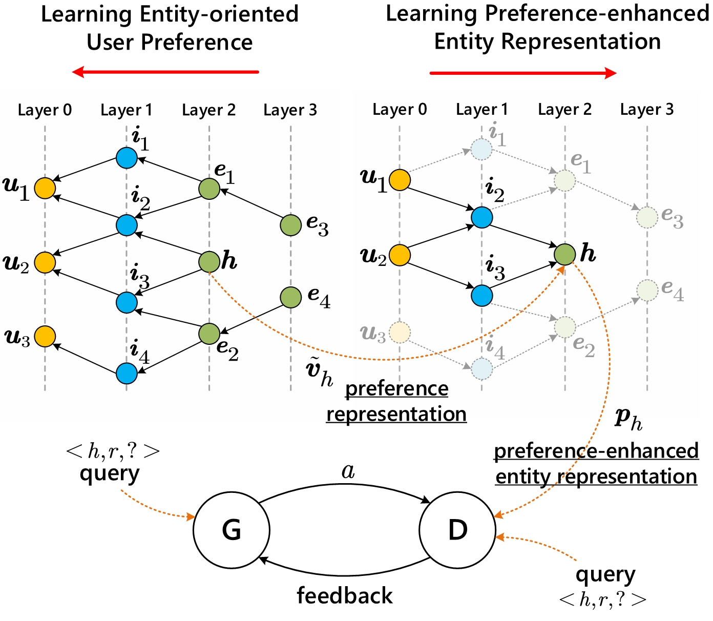

# UPGAN (User Preference enhanced GAN)

This is our Pytorch implementation for the paper:

> Gaole He, Junyi Li, Wayne Xin Zhao, Peiju Liu and Ji-Rong Wen (2020). Mining Implicit Entity Preference from User-Item Interaction Data for Knowledge Graph Completion via Adversarial Learning. [paper](https://arxiv.org/abs/2003.12718), [video](https://www.youtube.com/watch?v=SABAIvhhMm0&list=PLJNwhMK_V7EyZCUt6SjW4JthoM9-QiHMZ&index=43), [slides](https://github.com/RichardHGL/UPGAN/blob/master/www_slides.pptx). In WWW'2020, Taipei, Taiwan, China, April 20–24, 2020.

<div  align="center">    

</div>

## Introduction
In this paper, we take a new perspective that aims to leverage rich user-item interaction data (user interaction data for short) for improving the KGC task. Our work is inspired by the observation that many KG entities correspond to online items in application systems.

## Requirements:

- Python 3.6
- Pytorch >= 1.0

## Dataset
We provide three processed datasets in : Movielens, Last-FM, and Amazon-book.
* You can find the full version of recommendation datasets via [Movielens](https://grouplens.org/datasets/movielens/), [Last-FM](http://www.cp.jku.at/datasets/LFM-1b/), [Amazon-book](http://jmcauley.ucsd.edu/data/amazon).
* The linkage used in this dataset is from [KB4Rec](https://github.com/RUCDM/KB4Rec).

| | | Movie | Music | Book |
|:---:|:---|---:|---:|---:|
|| #Users | 61,859 | 57,976 | 75,639|
|User Interaction| #Items | 17,568 | 55,431 | 22,072|
| | #Interactions | 9,908,778 | 2,605,262 | 831,130|
|| #Entities | 56,789 | 108,930 | 79,682|
|Knowledge Graph | #Relations | 47 | 45 | 38 |
| | #Triplets | 953,598 | 914,842 | 400,787|

Each dataset is organized with following structure:
- `data-name/`
  - `rs/`
    - `u_map.dat`: user id mapping file;
    - `i_map.dat`: item id mapping file;
    - `i2kg_map.tsv`: mapping from original item id to freebase entity;
    - `ratings.txt`: raw rating file of dataset.
  - `kg/`
    - `e_map.dat`: entity id mapping file;
    - `r_map.dat`: relation id mapping file;
    - `train.dat`: mapped triples of train set;
    - `valid.dat`: mapped triples of validation set;
    - `test.dat`: mapped triples of test set.
    
## Training Instruction
Download preprocessed datasets from [google drive](https://drive.google.com/file/d/1zTss-wi7FGi3FmiqBZ8IFllgImoaC53_/view?usp=sharing),
and unzip it into data/ folder
use following args to run the code

```
--data_folder data/ 
--dataset AmazonBook/ LastFM/ Movielens
example commands: run_book.sh
```

## Acknowledgement
Any scientific publications that use our codes and datasets should cite the following paper as the reference:
```
@inproceedings{UPGAN-WWW-2020,
  author    = {Gaole He,
               Junyi Li,
               Wayne Xin Zhao,
               Peiju Liu and
               Ji{-}Rong Wen},
  title     = {Mining Implicit Entity Preference from User-Item Interaction Data for Knowledge Graph Completion via Adversarial Learning},
  booktitle = {{WWW}},
  year      = {2020}
}

@article{Zhao-DI-2019,
   author = {Wayne Xin Zhao and
               Gaole He and
               Kunlin Yang and
               Hong{-}Jian Dou and
               Jin Huang and 
               Siqi Ouyang and
               Ji{-}Rong Wen},
   title = {KB4Rec: A Data Set for Linking Knowledge Bases with Recommender Systems},
   journal = {Data Intelligence},
   volume = {1},
   number = {2},
   pages = {121-136},
   year = {2019},
   doi = {10.1162/dint\_a\_00008},

   URL = {https://doi.org/10.1162/dint_a_00008},
}
```
Nobody guarantees the correctness of the data, its suitability for any particular purpose, or the validity of results based on the use of the data set. The data set may be used for any research purposes under the following conditions:
* The user must acknowledge the use of the data set in publications resulting from the use of the data set.
* The user may not redistribute the data without separate permission.
* The user may not try to deanonymise the data.
* The user may not use this information for any commercial or revenue-bearing purposes without first obtaining permission from us.
