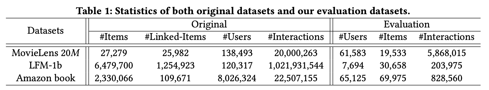
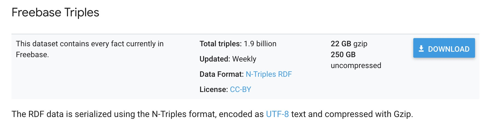

# KB4Rec

<!--This project is a description for dataset KB4Rec, a knowledge-aware recommder linkage dataset.-->
We released a linked dataset for research on knowledge-aware recommender systems: KB4Rec v1.0 [1]. It aims to associate items from recommender systems with entities from Freebase. 
## Directory
* [Motivations](#Motivations)
* [Datasets](#Datasets)
* [DownLoad and Usage](#Download)
* [How to get Freebase subgraph with our linkage](#Usage)
* [Licence](#Licence)
* [References](#References)
* [Related Papers](#Papers)
* [Additional Notes](#Addition)

## <div id="Motivations"></div>Motivations
<!--
Nowadays, recommender systems (RS), which aim to match users with interested items, have played an important role in various online applications. Traditional recommendation algorithms mainly focus on learning effective preference models from historical user-item interaction data, e.g. matrix factorization. With the rapid development of Web techniques, various kinds of side information has become available in RSs, called context. In an early stage, such context information is usually unstructured, and its availability is limited to specific data domains or platforms.-->
   
   Recently, more and more efforts have been made by both research and industry communities for structurizing world knowledge or domain facts in a variety of data domains. One of the most typical organization forms is knowledge base (KB), also called knowledge graph. KBs provide a general and unified way to organize and relate information entities, which have been shown to be useful in many applications. Specially, KBs have also been used in recommender systems, called knowledge-aware recommender systems.
   
   To address the need for the linked dataset of RS and KBs, we present the first public linked KB dataset for recommender systems, named KB4Rec v1.0. This dataset is first used in《Improving Sequential Recommendation with Knowledge-Enhanced Memory Networks》[2].
   
## <div id="Datasets"></div>Datasets
   <!--In our KB4Rec v1.0 dataset, we organized the linkage results by linked ID pairs, which consists of a RS item ID and a KB entity ID. All the IDs are inner values from the original datasets. Once such a linkage has been accomplished, it is able to reuse existing large-scale KB data for RSs.-->
<!--In our KB4Rec v1.0 dataset, we organized the linkage results by linked ID pairs, which consists of a RS item ID and a KB entity ID. All the IDs are inner values from the original datasets.-->
In our KB4Rec v1.0 dataset, we organized the linkage results by linked ID pairs, which consists of a RS item ID and a KB entity ID. All the IDs are inner values from the original datasets. Here, we present a sample snippet of our linkage results for MovieLens 20M, in which we pair a MovieLens item ID with a Freebase entity ID.

```   
                                           25991	m.09pglcq
                                           25993	m.0cjwhb
                                           25994	m.0k443
                                           25995	m.0b7kj8
```

<!--For example, the movie of <Avatar> from MovieLens dataset has a corresponding entity entry in Freebase, and we are able to obtain its attribute information by reading out all its associated relation triples in KBs.-->
Once such a linkage has been accomplished, it is able to reuse existing large-scale KB data for RSs. For example, the movie of from MovieLens dataset has a corresponding entity entry in Freebase, and we are able to obtain its attribute information by reading out all its associated relation triples in KBs.

   We consider three popular RS datasets for linkage, namely MovieLens 20M [3], LFM-1b [4] and Amazon book [5], which covers the three domains of movie, music and book respectively. For KB, we adopt the large-scale pubic KB Freebase [6]. For more details of our linkage, please refer to [our dataset paper](https://arxiv.org/abs/1807.11141) [1].
   
   We present the statistics of the linked dataset in the following table:
   
   
<!--
### Linkage Detail Statistics：
| Dataset                 | Items      |    Linked-Items    |  Linkage-ratio   | 
|:-------------------------:|:-------------:|:------------:|:------------:|
|MovieLens 20M|27,279 |25,982|95.2%|
|LFM-1b|6,479,700 |1,254,923|19.4%|
|Amazon book|2,330,066 |109,671|4.7%|

## <div id="Models"></div>Models
* KSR 
* [SVDfeature](http://apex.sjtu.edu.cn/projects/33)
-->
## <div id="Download"></div>DownLoad and Usage
### By using the datasets, you must agree to be bound by the terms of the following [license](#Licence).

* Our linkage dataset is provided in [Linkage](https://github.com/RUCDM/KB4Rec/tree/master/Linkage) folder of this repo.
* For easy usage, we provide the 1step subgraph extrated with following process and all entities in 1step subgraphs. You can download it [here](https://drive.google.com/open?id=1mkTVPRizvbzq-9SpCFurDBDaPGdgvkda). The 1step subgraph is not filtered with any constraint.
* You can get 2step subgraph with code and instruction in /expansion/2step/. All code is provided in this repo.

## <div id="Usage"></div>How to get Freebase subgraph with our linkage
With KB4Rec linkage and freebase dump, you can extract subgraph now. For the dump of freebase, you can download it from [freebase](https://developers.google.com/freebase/) (We use the latest version of this page).



The freebase subgraph is all triples related to current seed entity set. You can get freebase subgraph which 

(1) At first, the seed entity set only contain entities in our linkage. All triples which contain at least one entity in our linkage are called 1step subgraph.

(2) With the 1step subgraph extracted, we update the seed entity set to all entities appeared in 1step subgraph. (We only keep entities under freebase domain)

(3) With new entity set, similar to (1), we can get 2step subgraph. This subgraph is of rich semantics and fit for research purposes.

This process is simple and reproducible.

## <div id="Licence"></div>Licence

By using the datasets, you must agree to be bound by the terms of the following license.

```
License agreement
This dataset is made freely available to academic and non-academic entities for non-commercial purposes such as academic research, teaching, scientific publications, or personal experimentation. Permission is granted to use the data given that you agree:
1. That the dataset comes “AS IS”, without express or implied warranty. Although every effort has been made to ensure accuracy, we do not accept any responsibility for errors or omissions. 
2. That you include a reference to the KB4Rec v1.0 dataset in any work that makes use of the dataset. For research papers, cite our preferred publication as listed on our References; for other media cite our preferred publication as listed on our website or link to the dataset website.
3. That you do not distribute this dataset or modified versions. It is permissible to distribute derivative works in as far as they are abstract representations of this dataset (such as models trained on it or additional annotations that do not directly include any of our data) and do not allow to recover the dataset or something similar in character.
4. That you may not use the dataset or any derivative work for commercial purposes as, for example, licensing or selling the data, or using the data with a purpose to procure a commercial gain.
5. That all rights not expressly granted to you are reserved by us (Wayne Xin Zhao, School of Information, Renmin University of China).
```

## <div id="References"></div>References
If you use our linkage or subgraph, please kindly cite our papers.

You can cite this dataset as below.

```
@inproceedings{huang-SIGIR-2018,
  author    = {Jin Huang and
               Wayne Xin Zhao and
               Hong{-}Jian Dou and
               Ji{-}Rong Wen and
               Edward Y. Chang},
  title     = {Improving Sequential Recommendation with Knowledge-Enhanced Memory Networks}
  booktitle = {The 41st International {ACM} {SIGIR} Conference on Research {\&}
               Development in Information Retrieval, {SIGIR} 2018, Ann Arbor, MI,
               USA, July 08-12, 2018}
  pages     = {505--514}
  year      = {2018},
  url       = {http://doi.acm.org/10.1145/3209978.3210017},
  doi       = {10.1145/3209978.3210017},
}

@inproceedings{Zhao-arxiv-2018,
  author    = {Wayne Xin Zhao and
               Gaole He and
               Hong{-}Jian Dou and
               Jin Huang and 
               Siqi Ouyang and
               Ji{-}Rong Wen and},
  title     = {KB4Rec: A Dataset for Linking Knowledge Bases with Recommender Systems},
  year      = {2018},
  eprint = {arXiv:\embh{cond-mat}/1807.11141},
}

```
We also strongly recommend you to cite the original papers that share the copies of recommender system datasets [3,4,5] and knowledge bases [6]. You can find the related references in our paper. 

## <div id="Papers"></div>Related Papers
<strong>[1]  Wayne Xin Zhao, Gaole He, Hongjian Dou, Jin Huang, Siqi Ouyang and Ji-Rong Wen : KB4Rec: A Dataset for Linking Knowledge Bases with Recommender Systems. Arxiv 1807.11141. [paper](https://arxiv.org/abs/1807.11141)</strong>

<strong>[2] Jin Huang, Wayne Xin Zhao, Hong-Jian Dou, Ji-Rong Wen, Edward Y. Chang : Improving Sequential Recommendation with Knowledge-Enhanced Memory Networks. SIGIR 2018: 505-514. [paper](https://dl.acm.org/citation.cfm?doid=3209978.3210017) [code](https://github.com/BetsyHJ/KSR)</strong>

[3] F. Maxwell Harper, Joseph A. Konstan : The MovieLens Datasets: History and Context. TiiS 5(4): 19:1-19:19 (2016).

[4] Markus Schedl : The LFM-1b Dataset for Music Retrieval and Recommendation. ICMR 2016: 103-110.

[5] Ruining He, Julian McAuley : Ups and Downs: Modeling the Visual Evolution of Fashion Trends with One-Class Collaborative Filtering. WWW 2016: 507-517.

[6] Google : 2016. Freebase Data Dumps. https://developers.google.com/freebase/data.

<!--
* Jin Huang, Wayne Xin Zhao, Hong-Jian Dou, Ji-Rong Wen, Edward Y. Chang. Improving Sequential Recommendation with Knowledge-Enhanced Memory Networks. SIGIR 2018: 505-514. [paper](https://dl.acm.org/citation.cfm?doid=3209978.3210017) [code](https://github.com/BetsyHJ/KSR)
-->

## <div id="Addition"></div>Additional Notes
* The following people contributed to the the construction of the KB4Rec v1.0 dataset: Wayne Xin Zhao, Gaole He, Hongjian Dou, Jin Huang, Siqi Ouyang and Ji-Rong Wen. This project is lead by Wayne Xin Zhao, School of Information, Renmin University of China.
* If you have any questions or suggestions with this dataset, please kindly let us know. Our goal is to make the dataset reliable and useful for the community.
* For contact, send email to RUCKB4Rec@gmail.com, and cc Wayne Xin Zhao via batmanfly@gmail.com .
